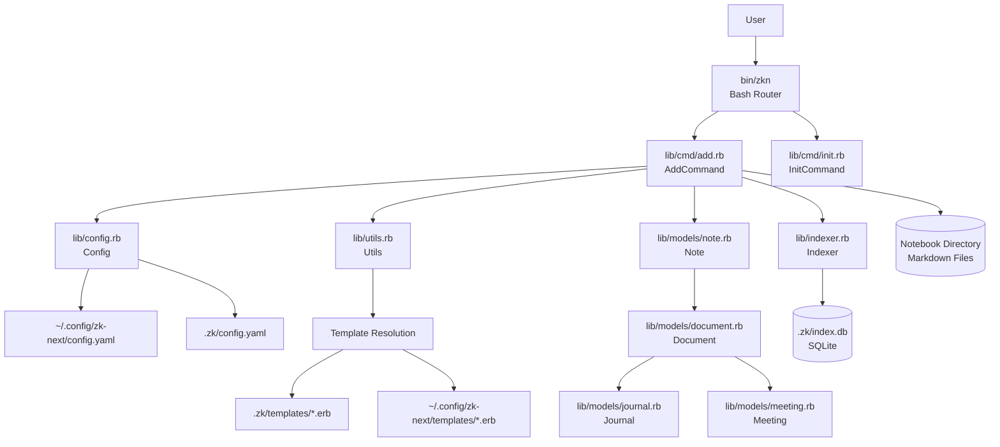
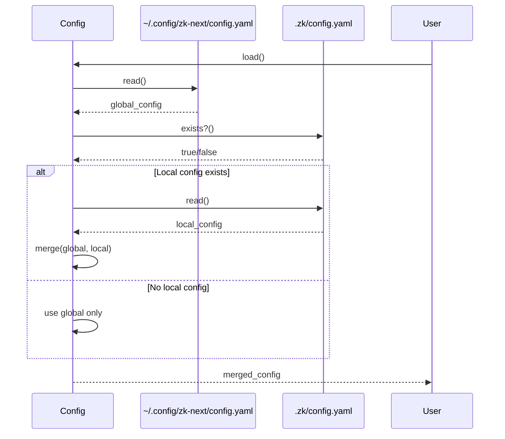
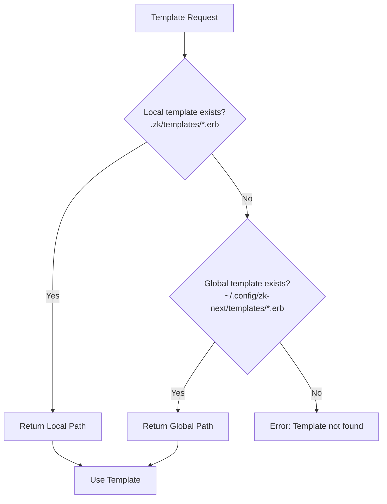

# zk-next Architecture

## System Overview

`zk-next` is a command-line tool for managing a Zettelkasten-style note-taking system. It provides a templating system for creating structured notes in GitHub-flavored Markdown with YAML front matter, and indexes these notes in a SQLite database for fast retrieval and search.

### Core Principles

- **Template-driven**: Notes are created from ERB templates with variable substitution
- **Type-based organization**: Different note types (notes, journals, meetings) can have different templates and file organization
- **Configuration hierarchy**: Global configuration with local notebook overrides
- **Indexed storage**: SQLite database for metadata indexing and future search capabilities
- **File-based storage**: Notes stored as Markdown files in the filesystem

## Architecture Diagram



## Component Architecture

### 1. CLI Layer (`bin/zkn`)

**Purpose**: Entry point and command router

**Responsibilities**:
- Parse command-line arguments
- Route to appropriate command implementation
- Handle command not found errors

**Implementation**: Bash script that delegates to Ruby command classes

**Key Features**:
- Simple case statement for command routing
- Passes remaining arguments to command implementations
- Provides usage information for unknown commands
- Shell completion support with dynamic command discovery

#### Shell Completion

The CLI provides bash completion support that automatically discovers commands from the `lib/cmd/` directory. This ensures that new commands automatically appear in shell completion without manual updates.

**Usage**:
- Generate completion script: `zkn _completion` or `zkn completion`
- Source for current session: `source <(zkn _completion)`
- Install permanently: Add `source <(zkn _completion)` to `~/.bashrc` or `~/.zshrc`

**How it works**:
- The completion script dynamically scans `lib/cmd/` for `.rb` files
- Command names are extracted from filenames (e.g., `add.rb` → `add`)
- Completion candidates are generated using bash's `compgen` builtin
- The completion function is registered with bash's `complete` builtin
- **Command-driven completion**: Each command implements its own completion logic via `--completion` option
- The bash completion script dynamically calls commands with `--completion` to get completion candidates

**Completion Features**:

1. **Command Name Completion**: Automatically discovers all commands from `lib/cmd/` directory
2. **Option Completion**: Provides completion for common options (`--help`, `--version`) when typing options (starting with `--`)
3. **Command-Specific Arguments**: Each command provides its own completions via `--completion` option
   - `add` command: Returns template types from configuration
   - `init` command: Returns empty (no arguments)
4. **Fully Dynamic**: New commands automatically provide completion without modifying the bash script

**Implementation Details**:
- **Command Completion Interface**: Commands check for `--completion` as first argument and output space-separated candidates
- **Bash Script**: Dynamically calls `ruby lib/cmd/{command}.rb --completion` to get completions
- **Helper Script**: `lib/cmd/_completion_helper.rb` provides shared completion data (common options)
- **Graceful Degradation**: Commands that don't implement `--completion` return empty completions
- **Error Handling**: Completion failures are handled gracefully (empty completions)

**Command Completion Pattern**:
Each command in `lib/cmd/` should implement the `--completion` option:

```ruby
def run(*args)
  return output_completion if args.first == '--completion'
  # Normal command execution
end

private

def output_completion
  # Return space-separated completion candidates
  puts candidates.join(' ')
end
```

**Extending Completion for New Commands**:
New commands automatically get completion support. To provide command-specific completions:
1. Implement `--completion` option handling in the command's `run` method
2. Add a private `output_completion` method that returns space-separated candidates
3. No changes needed to the bash completion script - it automatically discovers and calls the command

### 2. Command Layer (`lib/cmd/`)

**Purpose**: Business logic for each CLI command

**Pattern**: Each command is an executable Ruby script with a class implementing the command logic

#### AddCommand (`lib/cmd/add.rb`)

**Responsibilities**:
- Load configuration
- Resolve template configuration
- Find and render template file
- Parse template front matter for `config.path` override
- Create note file with proper naming and directory structure (using config.path if present)
- Remove `config` attribute from output file
- Reconstruct content using CommonMarker document objects
- Index the created note
- Provide completion candidates via `--completion` option (template types from configuration)

**Flow**:
1. Load merged config (global + local)
2. Get template configuration for note type
3. Find template file (local-first, fallback to global)
4. Render template with ERB variables
5. Parse front matter to check for `config.path` override
6. If `config.path` exists:
   - Use it as filepath (with variable interpolation)
   - Remove `config` attribute from metadata
   - Reconstruct content using CommonMarker
7. Otherwise, generate filename from pattern
8. Create file in appropriate subdirectory
9. Index note in SQLite database

**Template Config Override**:
Templates can include a `config.path` attribute in front matter to override the default
filename pattern. When present, this path is used instead of the configured `filename_pattern`
and `subdirectory`. The `config` attribute is automatically removed from the final output file.
The path supports variable interpolation using metadata fields and time variables.

**Important**: The `config.path` value **must be quoted** in the template to prevent
YAML parsing errors when the interpolated values contain special characters (e.g., `:`, `#`):
```yaml
config:
    path: "<%= id %>-<%= title %>.md"  # ✓ Correct: quoted
    path: <%= id %>-<%= title %>.md     # ✗ Wrong: unquoted (will fail with special chars)
```

**Filename Normalization with `slugify`**:
Templates have access to a `slugify` function that can be used to normalize strings for
filenames. The `slugify` function converts text to lowercase, replaces spaces and special
characters with a configurable replacement character (default: `-` hyphen), and cleans up
the result. This is useful for creating filesystem-friendly and URL-safe filenames:

```yaml
config:
    path: "<%= slugify(id) %>-<%= slugify(title) %>.md"
```

The `slugify` function is available in all ERB templates and can be called on any variable
or string value. The replacement character can be configured in `config.yaml` via the
`slugify_replacement` option (default: `'-'`). It preserves hyphens and existing underscores,
making it suitable for normalizing user-provided titles or other metadata that may contain
special characters.

**Date Format Configuration**:
The date format used in templates is configurable via the `date_format` option in `config.yaml`.
This uses Ruby's standard `strftime` format strings (default: `'%Y-%m-%d'` for ISO 8601).
The configured format affects the `date` variable available in ERB templates.

**Alias Pattern Configuration**:
Aliases are automatically generated for each note using a configurable pattern. The pattern
supports variable interpolation (similar to filename patterns) and defaults to
`'{type}> {date}: {title}'` (e.g., "note> 2024-01-15: Meeting Notes"). This format is
designed to aid searching with tools like `fzf` or `grep`. The pattern can be customized
via the `alias_pattern` option in `config.yaml` and supports variables: `{type}`, `{date}`,
`{title}`, `{year}`, `{month}`, and `{id}`.

#### InitCommand (`lib/cmd/init.rb`)

**Responsibilities**:
- Initialize new notebook directory
- Create `.zk` directory structure
- Create default local configuration file
- Provide completion candidates via `--completion` option (returns empty, no arguments)

### 3. Model Layer (`lib/models/`)

**Purpose**: Represent note documents and their metadata

#### Document (`lib/models/document.rb`)

**Base class** for all document types.

**Attributes**:
- `id`: Unique identifier (auto-generated if not provided)
- `title`: Document title
- `type`: Document type (note, journal, meeting, etc.)
- `path`: File system path to document
- `date`: Document date
- `content`: Document body content
- `metadata`: YAML front matter as hash
- `body`: Document body (content without front matter)

**Key Methods**:
- `generate_id`: Creates 8-character hex ID using SecureRandom

#### Note (`lib/models/note.rb`)

**Base note class** that extends Document.

**Responsibilities**:
- Parse Markdown file with YAML front matter
- Extract metadata from front matter
- Initialize Document with file contents

**Initialization**:
- Requires `path` parameter
- Reads file and parses front matter using `Utils.parse_front_matter`
- Merges provided metadata with file metadata
- Generates ID if not present in metadata

#### Specialized Types

- **Journal** (`lib/models/journal.rb`): Extends Note (currently empty, extension point)
- **Meeting** (`lib/models/meeting.rb`): Extends Note (currently empty, extension point)

### 4. Service Layer

#### Config (`lib/config.rb`)

**Purpose**: Configuration management with global/local merge strategy

**Responsibilities**:
- Load global configuration from `~/.config/zk-next/config.yaml`
- Load local configuration from `.zk/config.yaml` (if exists)
- Merge configurations (local overrides global)
- Normalize template configurations
- Resolve template configurations by type

**Configuration Structure**:
```yaml
notebook_path: ~/Documents/notes
templates:
  - type: note
    template_file: note.erb
    filename_pattern: "{type}-{date}.md"
    subdirectory: ""
```

**Template Normalization**:
- Ensures all template configs have required fields
- Provides defaults for optional fields (template_file, filename_pattern, subdirectory)

#### Indexer (`lib/indexer.rb`)

**Purpose**: Index note metadata in SQLite database

**Responsibilities**:
- Create SQLite database if it doesn't exist
- Create notes table schema
- Index note metadata (INSERT OR REPLACE)

**Database Schema**:
```sql
CREATE TABLE notes (
  id TEXT PRIMARY KEY,
  path TEXT,
  metadata TEXT  -- JSON-encoded metadata
)
```

**Storage Strategy**:
- Stores relative paths from notebook root
- Stores metadata as JSON string
- Uses INSERT OR REPLACE for idempotent updates

### 5. Utility Layer (`lib/utils.rb`)

**Purpose**: Shared utility functions

**Key Functions**:

- **`parse_front_matter(content)`**: Parses YAML front matter from Markdown using CommonMarker
  - Returns `[metadata_hash, body_content]`
  - Handles front matter delimiters (`---`)

**Markdown Construction**:
- Always use CommonMarker to construct markdown documents programmatically
- Parse content with CommonMarker to validate and format
- Use CommonMarker's document objects rather than string concatenation
- This ensures proper formatting and consistency with CommonMark standards
  
- **`current_time_vars(date_format: nil)`**: Returns hash of time-based template variables
  - `date`: Formatted using configured date format (default: `'%Y-%m-%d'` ISO 8601)
  - `year`: 4-digit year
  - `month`: 2-digit month
  - `id`: 8-character hexadecimal ID (generated using SecureRandom via `Utils.generate_id`)
  - Date format can be configured via `date_format` in config.yaml

- **Alias Generation**: Aliases are automatically generated in `AddCommand.render_template` using
  the configured `alias_pattern` (default: `'{type}> {date}: {title}'`). The pattern supports
  variable interpolation with all available template variables. Aliases are useful for searching
  with tools like `fzf` or `grep`.

- **`interpolate_pattern(pattern, variables)`**: Replaces `{key}` placeholders in patterns
  - Used for filename patterns and subdirectory paths
  - Supports metadata fields as variables

- **`slugify(text, replacement_char: '-')`**: Normalizes strings for use in filenames
  - Converts to lowercase
  - Replaces spaces and special characters with replacement character (default: `-` hyphen)
  - Collapses multiple consecutive replacement characters
  - Removes leading/trailing replacement characters
  - Preserves hyphens and existing underscores
  - Available in ERB templates via the binding context
  - Replacement character is configurable via `slugify_replacement` in config.yaml

- **`find_template_file(notebook_path, template_filename)`**: Template resolution
  - Checks local: `.zk/templates/{filename}`
  - Falls back to global: `~/.config/zk-next/templates/{filename}`
  - Returns first found path or nil

- **`generate_id`**: Generates 8-character hex ID using SecureRandom. This is the shared ID generation method used by both `Document.generate_id` and `Utils.current_time_vars` to ensure consistent ID generation across all note creation paths.

## Data Flow

### Note Creation Flow

```mermaid
sequenceDiagram
    participant User
    participant CLI as bin/zkn
    participant AddCmd as AddCommand
    participant Config as Config
    participant Utils as Utils
    participant ERB as ERB Template
    participant FileSystem
    participant Note as Note Model
    participant Indexer

    User->>CLI: zkn add journal
    CLI->>AddCmd: run('journal')
    AddCmd->>Config: load()
    Config-->>AddCmd: merged_config
    AddCmd->>Config: get_template('journal')
    Config-->>AddCmd: template_config
    AddCmd->>Utils: find_template_file('journal.erb')
    Utils-->>AddCmd: template_path
    AddCmd->>Utils: current_time_vars()
    Utils-->>AddCmd: {date, year, month, id}
    AddCmd->>ERB: render(template, vars)
    ERB-->>AddCmd: rendered_content
    AddCmd->>Utils: interpolate_pattern(filename_pattern, vars)
    Utils-->>AddCmd: generated_filename
    AddCmd->>FileSystem: write(note_file, content)
    AddCmd->>Note: new(path: filepath)
    Note->>Utils: parse_front_matter(content)
    Utils-->>Note: [metadata, body]
    Note-->>AddCmd: note_instance
    AddCmd->>Indexer: index_note(note)
    Indexer->>Indexer: INSERT OR REPLACE INTO notes
    Indexer-->>AddCmd: indexed
    AddCmd-->>User: "Note created: {filepath}"
```

### Configuration Loading Flow



### Template Resolution Flow



## Configuration System

### Configuration Hierarchy

1. **Global Configuration** (`~/.config/zk-next/config.yaml`)
   - Default notebook path
   - Default templates
   - User-wide settings

2. **Local Configuration** (`.zk/config.yaml` in notebook directory)
   - Overrides global settings
   - Notebook-specific templates
   - Notebook-specific paths

### Configuration Merge Strategy

- Local configuration values override global values
- Template arrays are replaced (not merged)
- `notebook_path` is always expanded to absolute path
- Missing local config uses global config only

### Global Configuration Options

- **`notebook_path`**: Path to the Zettelkasten notebook directory
- **`date_format`**: Ruby strftime format string for date formatting (default: `'%Y-%m-%d'` ISO 8601)
- **`slugify_replacement`**: Character to use for replacing spaces/special chars in slugify (default: `'-'` hyphen)
- **`alias_pattern`**: Pattern for generating note aliases (default: `'{type}> {date}: {title}'`)
- **`templates`**: Array of template definitions

### Template Configuration

Each template definition includes:

- **type**: Identifier for the template (e.g., "note", "journal", "meeting")
- **template_file**: ERB template filename
- **filename_pattern**: Pattern for generated filenames (supports `{type}`, `{date}`, `{year}`, `{month}`, `{id}`, and metadata fields)
- **subdirectory**: Relative path from notebook_path (supports same variable interpolation)

## File Structure

```
zk-next/
├── bin/
│   └── zkn                    # CLI entry point (Bash router)
├── lib/
│   ├── cmd/                   # Command implementations
│   │   ├── add.rb            # Add command
│   │   └── init.rb           # Init command
│   ├── models/                # Data models
│   │   ├── document.rb       # Base Document class
│   │   ├── note.rb           # Base Note class
│   │   ├── journal.rb        # Journal type (extends Note)
│   │   └── meeting.rb        # Meeting type (extends Note)
│   ├── config.rb             # Configuration management
│   ├── indexer.rb            # SQLite indexing
│   ├── utils.rb              # Utility functions
│   ├── defaults.rb           # Default configuration (unused)
│   └── templates/
│       └── note.erb       # Default template
├── test/                      # Test suite
│   ├── cmd/                  # Command tests
│   ├── models/               # Model tests
│   └── zk.bats               # Shell script tests
├── examples/                  # Example configurations
└── README.md                  # Project documentation
```

## Dependencies

### External Tools

- **gum**: Interactive CLI prompts (planned/future use)
- **fzf**: Fuzzy finder (planned/future use)
- **ripgrep**: Fast text search (planned/future use)
- **bat**: Syntax highlighting (planned/future use)
- **sqlite**: Database operations (via sqlite3 gem)

### Ruby Gems

- **sqlite3**: SQLite database interface
- **commonmarker**: Markdown parsing with front matter support
- **minitest**: Testing framework (development)
- **rubocop**: Code style checker (development)

### Standard Library

- **erb**: Template rendering
- **yaml**: Configuration parsing
- **securerandom**: ID generation
- **fileutils**: File operations
- **pathname**: Path manipulation
- **json**: Metadata serialization

## Extension Points

### Adding New Document Types

1. Create new model class in `lib/models/`:
   ```ruby
   require_relative 'note'
   
   class NewType < Note
     # Add type-specific behavior
   end
   ```

2. Add template configuration to config.yaml:
   ```yaml
   templates:
     - type: newtype
       template_file: newtype.erb
       filename_pattern: "{type}-{date}.md"
       subdirectory: "newtype/{year}"
   ```

3. Create ERB template file in template directory

   **Important: YAML Quoting Requirements**
   
   When writing ERB templates, properly quote YAML values to avoid parsing errors:
   
   - **String values must be quoted** if they may contain special YAML characters (`:`, `#`, `[`, `]`, etc.):
     ```yaml
     title: "<%= title %>"
     date: "<%= date %>"
     ```
   
   - **The `config.path` field must always be quoted** since it may contain special characters:
     ```yaml
     config:
         path: "<%= id %>-<%= title %>.md"
     ```
   
   - **The `tags` field should NOT be quoted** since it's rendered as an inline YAML array:
     ```yaml
     tags: <%= tags %>
     ```

### Adding New Commands

1. Create command class in `lib/cmd/`:
   ```ruby
   #!/usr/bin/env ruby
   # frozen_string_literal: true
   
   require_relative '../config'
   
   class NewCommand
     def run(*args)
       return output_completion if args.first == '--completion'
       
       # Command logic
     end
     
     private
     
     def output_completion
       # Return space-separated completion candidates
       # Example: puts 'arg1 arg2 arg3'
       # Or empty if no arguments: puts ''
       puts ''
     end
   end
   
   NewCommand.new.run(*ARGV) if __FILE__ == $PROGRAM_NAME
   ```

2. Add route in `bin/zkn`:
   ```bash
   newcommand)
     ruby "$DIR/../lib/cmd/newcommand.rb" "$@"
     ;;
   ```

3. Add tests in `test/cmd/newcommand_test.rb`

4. **Implement completion** (required):
   - Add `--completion` option handling in `run` method
   - Implement `output_completion` method that returns space-separated candidates
   - Commands automatically appear in shell completion
   - Completion is dynamically discovered - no bash script changes needed

**Note**: The completion system automatically discovers all `.rb` files in `lib/cmd/` directory and calls them with `--completion` to get completion candidates. Commands that don't implement `--completion` will gracefully return no completions.

### Adding New Template Variables

1. Extend `Utils.current_time_vars` to include new variables
2. Variables are automatically available in ERB templates
3. Variables can be used in `filename_pattern` and `subdirectory` patterns

### Adding New Template Functions

1. Add function to `Utils` module as a class method
2. Make function available in ERB binding context in `AddCommand.render_template`
3. Functions can be called from templates (e.g., `slugify` is available as `<%= slugify(title) %>`)

## Architecture Patterns

### Inheritance Model

```
Document (base class)
  └── Note (file-based initialization)
       ├── Journal (specialized type)
       └── Meeting (specialized type)
```

- **Document**: Abstract base with core attributes
- **Note**: Adds file parsing and front matter extraction
- **Specialized Types**: Extension points for type-specific behavior

### Configuration Pattern

- **Global + Local Merge**: Hierarchical configuration with local overrides
- **Template Normalization**: Ensures consistent template configuration structure
- **Path Expansion**: All paths normalized to absolute paths

### Template Resolution Pattern

- **Local-First**: Check notebook-local templates before global
- **Fallback Strategy**: Graceful degradation with clear error messages
- **Variable Interpolation**: Consistent `{variable}` pattern throughout

### Command Pattern

- **Executable Scripts**: Each command is a standalone executable
- **Class-Based**: Commands implemented as classes with `run` method
- **Argument Passing**: CLI router passes all arguments to command

### Indexing Strategy

- **Idempotent Updates**: INSERT OR REPLACE ensures consistency
- **Relative Paths**: Store paths relative to notebook root
- **JSON Metadata**: Flexible metadata storage as JSON string
- **Minimal Schema**: Simple schema allows future extension

## Future Architecture Considerations

This section documents identified improvement opportunities and planned enhancements to the architecture.

### Model Layer Enhancements

**Current State**: 
- `Journal` and `Meeting` classes are empty placeholders
- No type-specific behavior implemented
- No validation of document structure or metadata

**Improvements**:
- **Type-Specific Behavior**: Implement specialized methods in Journal/Meeting classes
  - Journal: Date-based organization, daily/weekly views
  - Meeting: Attendee tracking, action items extraction
- **Validation**: Add validation logic for document types
  - Required fields per type
  - Format validation (dates, IDs, etc.)
  - Schema validation for metadata
- **Relationships**: Support linking between documents
  - Backlinks: Automatic reverse link tracking
  - Link graph: Visualize document relationships
  - Link validation: Ensure linked documents exist
- **Tags**: Built-in tag support in metadata
  - Tag normalization (lowercase, no spaces)
  - Tag hierarchy (parent/child tags)
  - Tag-based queries and filtering

### Indexer Enhancements

**Current State**:
- Minimal schema: id, path, metadata (JSON)
- No full-text search
- No relationship tracking
- Metadata queries require JSON parsing

**Improvements**:
- **Full-Text Search**: SQLite FTS5 integration for content search
  - Index note body content
  - Search across title, body, and metadata
  - Ranking and relevance scoring
- **Relationship Indexing**: Link graph for document relationships
  - Links table: source_id, target_id, link_type
  - Backlink queries: find documents linking to a note
  - Link statistics: most linked notes, orphaned notes
- **Tag Indexing**: Fast tag-based queries
  - Tags table: normalized tag storage
  - Tag statistics: tag frequency, co-occurrence
  - Tag autocomplete for UI
- **Date Range Queries**: Efficient date-based filtering
  - Index date field separately
  - Date range queries (last week, this month, etc.)
  - Temporal analysis (notes over time)
- **Metadata Queries**: Query by any metadata field
  - JSON extraction functions for common fields
  - Computed columns for frequently queried metadata
  - Metadata search interface

### Command Structure

**Current State**:
- Manual command registration in Bash router
- No help system
- No command discovery
- Basic argument passing

**Improvements**:
- **Command Registry**: Dynamic command discovery
  - Auto-discover commands in `lib/cmd/`
  - Plugin system for external commands
  - Command metadata (description, usage, examples)
- **Command Help**: Built-in help system
  - `zkn help` or `zkn <command> --help`
  - Auto-generated from command metadata
  - Usage examples and common patterns
- **Command Aliases**: Short names for common commands
  - `a` for `add`, `i` for `init`
  - Configurable aliases
- **Interactive Mode**: REPL-style interface using gum
  - Interactive command selection
  - Template selection with preview
  - Interactive note editing

### Error Handling

**Current State**:
- Basic error handling with `exit 1`
- Error messages via `puts`
- No structured error types
- Limited error recovery

**Improvements**:
- **Structured Errors**: Custom exception classes
  - `ConfigError`, `TemplateError`, `IndexError`, etc.
  - Error codes for programmatic handling
  - Error context (file, line, config key, etc.)
- **Error Recovery**: Graceful handling of common errors
  - Missing template: suggest creating one
  - Invalid config: show validation errors
  - Database locked: retry with backoff
- **User Feedback**: Clear, actionable error messages
  - What went wrong
  - Why it happened
  - How to fix it
- **Logging**: Optional debug logging
  - Log levels (error, warn, info, debug)
  - Log to file or stderr
  - Performance logging for slow operations

### Testing Architecture

**Current State**:
- Minitest for Ruby tests
- Bats for shell script tests
- Basic test coverage
- Manual test fixtures

**Improvements**:
- **Test Coverage**: Comprehensive unit and integration tests
  - Aim for >80% code coverage
  - Integration tests for full workflows
  - Edge case testing
- **Test Fixtures**: Reusable test data and configurations
  - Shared test fixtures directory
  - Factory methods for test objects
  - Template fixtures for testing
- **Mock Strategy**: Mock external dependencies (file system, database)
  - Mock file system operations
  - In-memory SQLite for tests
  - Mock external tools (gum, fzf, etc.)
- **Test Organization**: Mirror source structure in test directory
  - Test files match source files
  - Shared test utilities
  - Test helpers for common operations

### Configuration System Enhancements

**Current State**:
- Shallow merge of configs
- Template arrays replaced, not merged
- No config validation
- No config schema

**Improvements**:
- **Deep Merge**: Merge nested structures intelligently
  - Merge template arrays by type
  - Preserve global templates when local adds new ones
  - Merge nested config values
- **Config Validation**: Validate configuration on load
  - Required fields check
  - Type validation
  - Path existence validation
  - Template file existence check
- **Config Schema**: Define expected configuration structure
  - Schema definition (YAML or JSON Schema)
  - Validation against schema
  - Auto-generated config documentation
- **Config Migration**: Handle config format changes
  - Version field in config
  - Migration scripts for format changes
  - Backward compatibility

### Performance Optimizations

**Current State**:
- Sequential note indexing
- No caching
- Full file reads for parsing
- No incremental indexing

**Improvements**:
- **Batch Indexing**: Index multiple notes efficiently
  - Transaction-based batch inserts
  - Bulk operations for large notebooks
- **Caching**: Cache frequently accessed data
  - Config caching (with invalidation)
  - Template caching
  - Metadata caching for recently accessed notes
- **Incremental Indexing**: Only index changed notes
  - File modification time tracking
  - Change detection
  - Background indexing
- **Lazy Loading**: Load data only when needed
  - Lazy note parsing
  - Lazy metadata extraction
  - Stream large file operations

## Architecture Documentation Maintenance

This section outlines processes and guidelines for keeping architecture documentation up to date as the codebase evolves.

### When to Update ARCHITECTURE.md

Update `ARCHITECTURE.md` when:

1. **New Components Added**: New commands, models, services, or utilities
   - Document the component's purpose and responsibilities
   - Update component architecture diagrams
   - Add to extension points section if applicable

2. **Component Behavior Changes**: Significant changes to existing components
   - Update relevant sections describing behavior
   - Update data flow diagrams if flows change
   - Note breaking changes or deprecations

3. **New Patterns Introduced**: New architectural patterns or design decisions
   - Document the pattern in Architecture Patterns section
   - Add ADR if it's a significant decision
   - Update extension points if it affects extensibility

4. **Dependencies Change**: New external tools or gems added/removed
   - Update Dependencies section
   - Note why dependency was added/removed
   - Update installation/setup instructions if needed

5. **Configuration Changes**: Changes to config structure or behavior
   - Update Configuration System section
   - Update examples if format changes
   - Document migration path if breaking change

6. **File Structure Changes**: Significant directory or file organization changes
   - Update File Structure section
   - Update component references if paths change

### When to Update ARCHITECTURE_DECISIONS.md

Update `docs/ARCHITECTURE_DECISIONS.md` when:

1. **New Significant Decision**: Major architectural choice made
   - Add new ADR following the format
   - Include context, decision, and consequences
   - Mark status (Proposed, Accepted, Deprecated, Superseded)

2. **Decision Revisited**: Existing decision is changed or superseded
   - Update status to "Superseded"
   - Add new ADR explaining the change
   - Link from old ADR to new one

3. **Decision Deprecated**: Decision is no longer relevant
   - Update status to "Deprecated"
   - Add note explaining why deprecated

### Review Process

**Before Merging Architecture Changes**:

1. **Self-Review**: 
   - Ensure diagrams are accurate and render correctly
   - Verify all code examples are current
   - Check that links to files are correct
   - Ensure formatting is consistent

2. **Code Review**:
   - Architecture changes should be reviewed alongside code changes
   - Reviewers should verify documentation matches implementation
   - Flag any discrepancies between docs and code

3. **Periodic Review**:
   - Quarterly review of entire architecture documentation
   - Verify all sections are still accurate
   - Update outdated examples or references
   - Remove deprecated information

### Documentation Standards

**Diagrams**:
- Use Mermaid syntax for all diagrams
- Test diagrams render correctly in GitHub/Markdown viewers
- Keep diagrams simple and focused
- Update diagrams when architecture changes

**Code Examples**:
- Use actual code from the codebase when possible
- Keep examples current with latest code
- Include file paths in examples
- Show complete, runnable examples when helpful

**File References**:
- Use relative paths from project root
- Link to actual files using markdown links: `[filename](path/to/file)`
- Verify links are correct and files exist

**Terminology**:
- Use consistent terminology throughout
- Define acronyms on first use
- Maintain glossary if terminology grows

### Integration with Development Workflow

**For New Features**:
1. Update architecture docs as part of feature implementation
2. Document new components before or during implementation
3. Add ADR if feature introduces new architectural pattern

**For Refactoring**:
1. Update architecture docs to reflect refactored structure
2. Update diagrams if component relationships change
3. Add ADR if refactoring changes architectural decisions

**For Bug Fixes**:
1. Update docs if fix reveals incorrect documentation
2. Note any architectural implications of the bug
3. Update error handling section if fix improves error handling

### Version Alignment

- Architecture docs should reflect the current state of the codebase
- When releasing versions, ensure docs are up to date
- Consider versioning architecture docs if making breaking changes
- Link architecture docs to code versions in CHANGELOG if significant

### Maintenance Checklist

When updating architecture documentation, verify:

- [ ] All diagrams render correctly
- [ ] All file paths are correct and files exist
- [ ] Code examples are current and runnable
- [ ] Component descriptions match implementation
- [ ] Data flow diagrams reflect actual flows
- [ ] Extension points are documented
- [ ] Dependencies list is accurate
- [ ] Configuration examples are valid
- [ ] Links to other docs are working
- [ ] Terminology is consistent
- [ ] ADRs are up to date if decisions changed
